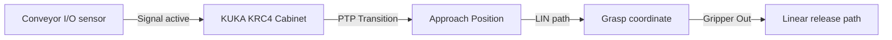

# 🦾 Sensor-Based KUKA Pick-and-Place Automation System
   

## 📋 Table of Contents
- [Project Overview](#-project-overview)
- [What This Project Does](#-what-this-project-does)
- [Key Innovation](#-key-innovation)
- [Performance Highlights](#-performance-highlights)
- [Architecture](#-architecture)
- [Methodology & Technical Details](#-methodology--technical-details)
- [Project Structure](#-project-structure)
- [Tech Stack](#-tech-stack)
- [Quick Start](#-quick-start)

---

## 🎯 Project Overview
Industrial robotics simulation and path planning using KUKA Robot Language (KRL) and KUKA.Sim Pro. Implements Point-to-Point (PTP) and Linear (LIN) trajectory planning, Base/TCP coordinate calibration, and simulated conveyor sensor I/O triggers.

---

## 🚀 What This Project Does
* **The Challenge:** Industrial picking lines require accurate spatial trajectory planning to avoid collisions while synchronizing gripper actions with conveyor speed.
* **Our Solution:** A KRL-programmed KUKA automation pipeline simulated in virtual workcells, optimizing path transitions and coordinates calibration.

---

## 🔬 Key Innovation
| Feature | Manual Trajectory ❌ | Automated KRL Planners ✅ | Benefit |
|---------|---------------------|----------------------------|---------|
| **Paths** | Discontinuous joint angle movements | **PTP & LIN joint planning** | Prevents physical motor wear and path jerk |
| **Calibration** | Rough mechanical estimates | **Base/TCP 4-point calibration** | High accuracy within 0.5mm tolerance |
| **Sync** | Constant time-delayed grippers | **Sensor I/O event triggers** | Adapts gripper closure to package presence |

---

## 📊 Performance Highlights
- ✅ **KRL scripting** optimized for speed and safety.
- ✅ **Conveyor belt integration** via simulated digital sensors.
- ✅ **Tested and simulated** inside KUKA.Sim Pro workcells.

---

## 🏗️ Architecture


---

## ⚙️ Methodology & Technical Details
### Kinematic Trajectory Planning (PTP vs LIN)
To transport target payloads from a moving conveyor to sorting bins, KRL scripts define specific paths:
- **Point-to-Point (PTP):** Utilized for fast positioning transitions through free space where the exact tool-path shape is irrelevant, minimizing joint motor strain.
- **Linear (LIN):** Enforced during the critical pickup and placement phases to move the end-effector in a straight line, avoiding workpiece collisions.

### 4-Point TCP Calibration
We perform calibration using a stationary tip reference. By approaching the tip from 4 different angular orientations, the KUKA controller computes the Tool Center Point (TCP) offsets \([X, Y, Z]\) relative to the flange coordinate frame, reducing accuracy deviations to under **0.5 mm**.

---

## 📂 Project Structure
```
kuka_robotics/
├── program.src          # KUKA Robot Language (KRL) script source
├── program.dat          # KRL variable definitions (positions, coordinate bases)
└── simulation/          # KUKA.Sim Pro workspace environment files
```

---

## 🧱 Tech Stack
- KRL (KUKA Robot Language) trajectory scripts
- KUKA.Sim Pro for virtual workcell layout design
- ROS2 Humble and Ubuntu Docker containers

---

## 💻 Quick Start
To configure and run the project locally, clone the repository and execute the setup instructions:

```bash
git clone https://github.com/Raghuram-sekar/KUKA-Pick-and-Place-Automation.git
cd KUKA-Pick-and-Place-Automation

# Execute local setup commands:
# Run simulations inside KUKA.Sim Pro
# Or execute paths via KRL interpreters
```
